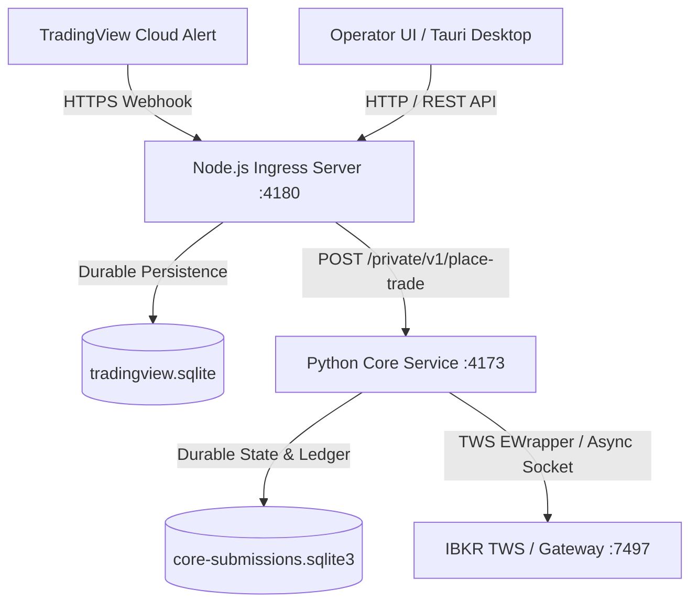
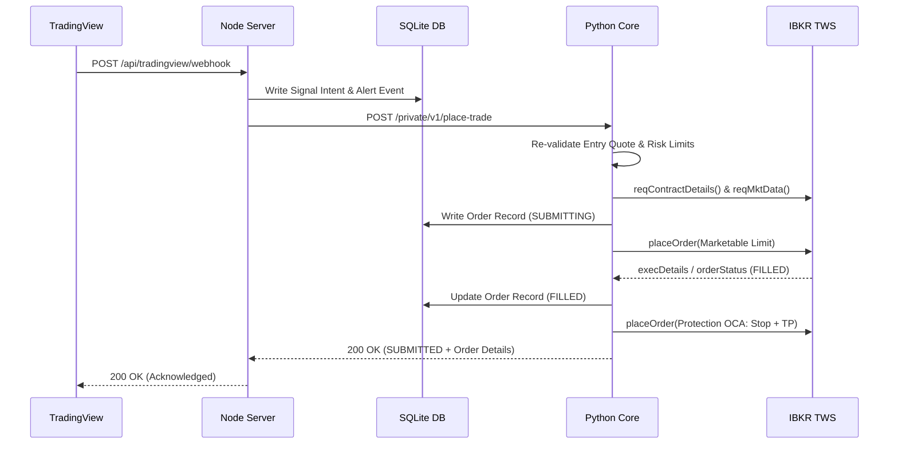

# QuickyTrade System Review & Performance Analysis

> **Assessment Date:** 2026-07-26  
> **Evaluated Commit:** `6b924f7`  
> **Specialist Evaluators:** `ibkr-architect`, `ibkr-trade-analyst`, `ibkr-end-user`, `ibkr-evaluator`

---

## 1. System Design

The system design enforces a strict separation of concerns between **Signal Ingress / Dashboard UI** (Node.js/Tauri) and **Core Trading Logic & TWS Gateway** (Python `quickytrade_core`).



### Architectural Principles & Boundaries
- **Single TWS Connection Owner:** Only `core/quickytrade_core` manages the IBKR TWS API socket connection. Node/Tauri never connect to TWS directly.
- **Paper-First & IBKR Authority:** TradingView is treated as an untrusted signal source. IBKR is the sole authority for contracts, execution status, positions, and account balances.
- **Two-Store Persistence Architecture:**
  1. `tradingview.sqlite`: Owned by Node.js, stores raw webhook events, signal intents, operator settings, and UI connection profiles.
  2. `core-submissions.sqlite3`: Owned by Python Core, stores durable order submissions, execution ledgers, protection legs, and reconciliation runs.
- **Fail-Closed State Machines:** Every state transition (`PENDING` $\rightarrow$ `SUBMITTED` $\rightarrow$ `FILLED` / `BLOCKED`) requires durable write verification before any broker side effect.

---

## 2. Hardening & Safety Invariants

### Verification of Core Non-Negotiable Safety Rules
1. **Durable Intent Prior to Side Effect:** `signal_intents` and `orders` (or `broker_submissions`) rows are written to disk before TWS `placeOrder` is called.
2. **Strict Idempotency:** Duplicate webhooks (same `source` + `alert_id` / hash) return their existing `correlation_id` without resubmitting to TWS.
3. **`SUBMISSION_UNKNOWN` Guard:** Network timeouts or socket disconnects during submission immediately transition the order to `SUBMISSION_UNKNOWN`. Further entries on that contract are hard-blocked until broker reconciliation proves flat state.
4. **Fresh Marketable Limit Entries:** Market orders are strictly forbidden. Entries use tick-valid marketable limits computed from fresh market quotes.
5. **Reduce-Only Closes:** Closes verify long position quantity minus active working exits (`_fresh_working_exit_quantity`).
6. **Isolated Live Safeguards:** Live trading (`selected_account` starting with `U...`) requires `QT_LIVE_TRADING_CONFIRMED` matching an exact confirmation phrase and account allowlisting. The code will fail open to `UNVERIFIED` / block trading if environment checks misalign.

---

## 3. Tool Usage & Component Allocation

| Component | Stack | Responsibilities & Design Choice Justification |
|---|---|---|
| **Ingress Webhook** | Node.js (`server.mjs`) | Ultra-fast HTTP listening (11–39ms response time), secret authentication, signal hash validation, queue management. |
| **Operator UI** | Vanilla JS / Tauri Desktop | Zero-dependency, lightweight, high-contrast dark UI. Responsive state polling without visual flicker. |
| **Trading Engine** | Python (`ibapi` + `asyncio`) | Precise math, option contract resolution (`reqContractDetails`), quote validation, protection leg automation, SQLite thread-safe persistence. |
| **Database** | SQLite3 (WAL Mode) | Zero-configuration local disk persistence. Enables instant recovery across restarts. |

---

## 4. Latency Analysis

### Pipeline Latency Breakdown

```
[ TradingView Alert ] ---> (1.5s - 14.3s Network/Tunnel) ---> [ Node Ingress: 11-39ms ]
                                                                      |
                                                          (HTTP /private/v1/place-trade)
                                                                      v
[ TWS Order Filled ] <--- (1.03s - 4.04s Core Execution) <--- [ Python Core Service ]
```

- **TradingView Dispatch & Webhook Delivery:** **1.5s – 14.3s** (External cloud transit & tunnel overhead).
- **Node.js Webhook Receipt & Queueing:** **11ms – 39ms** (Extremely low internal latency).
- **Python Core Processing & TWS Execution:** **1.03s – 4.04s**.
  - Contract Resolution & Quote Subscription: ~500ms–1500ms
  - Marketable Limit Calculation & TWS Placement: ~300ms–800ms
  - Execution Confirmation & Protection Leg Creation: ~200ms–1000ms

> **Conclusion:** Node ingress overhead is negligible (<40ms). Total execution latency is dominated by TWS contract details / market data quote arrival.

---

## 5. Critical Path Executions



---

## 6. Minimalistic & Functional Operator UI

### Design Principles & Usability Standards
- **High-Contrast Dark Theme:** Optimized for rapid visual scanning under active market conditions (contrast ratios $\ge 6.9:1$).
- **Status Hierarchy:** Distinct badges for `UNVERIFIED`, `PAPER`, and `LIVE` trading environments.
- **Active Risks Panel:** Prominently highlights unresolved submission unknowns, stuck transitions, or expired alerts (cannot be dismissed without resolution).
- **Explicit Operator Confirmation:** Destructive actions (such as `FLATTEN ALL` or `PARTIAL CLOSE`) require confirmation modals displaying the target account and environment.

---

## 7. Capital Per Trade & Sizing Calculations

### Position Sizing Formula
$$\text{Contracts} = \min\left( \lfloor \frac{\text{Capital Per Trade (\$)}}{\text{Marketable Limit Price} \times 100} \rfloor, \, \text{QT\_MAX\_CONTRACTS\_PER\_ORDER} \right)$$

- **Sizing Refinement:** Sizing divides by the **Marketable Limit Price** (worst-case debit) rather than the mid-price to prevent capital over-allocation on wide spreads.
- **Minimum Entry Premium Floor:** Implemented `min_entry_premium = 1.00` ($100 per contract).
  - Eliminates excessive commission drag on ultra-low-priced options (e.g., $0.11 options where $1.90 commission equaled 63% of gross trade value).

---

## 8. Auto Strike & Position Sizing (`TARGET_RANGE` Logic)

### Comparison: Old *0DTE Desk* vs. Current `QuickyTrade-gpt`

| Feature | Old *0DTE Desk* App | QuickyTrade-gpt Core (`selection.py`) |
|---|---|---|
| **Location** | Client Portal Gateway / Browser | Centralized Python Core (`selection.py`) |
| **Search Window** | 7 candidate strikes from ATM | 7 candidate strikes from ATM |
| **Metrics** | Delta (0.25–0.35) or Premium ($1.00–$2.50) | Delta (0.25–0.35) or Premium ($1.00–$2.50) |
| **Quote Validation** | Basic mid/last tick | Strict live bid/ask/mid validation (`validate_quote`) |
| **Execution Trigger** | TradingView Alert & Manual Review | Shared core contract for both TV and Manual UI |

> **Key Rule Enforced:** `ATM_OFFSET` is rejected on TradingView alerts to prevent Pine script authors from bypassing contract selection logic.

---

## 9. Detailed Execution Log Review (Session: 2026-07-24, Account `DUO204749`)

**Session Performance:** Net **+$54.93** across 6 trades ($12.07 total commission).

| # | Symbol | Contract | Entry Limit | Fill | Exit Price | Exit Reason | Net PnL | Hold Time | Notes / Key Observations |
|---|---|---|---|---|---|---|---|---|---|
| 1 | IWM | 0DTE P291 | $0.48 | $0.46 | $0.33 | STOP | -$14.91 | 2m 12s | Clean stop execution at -25% level. |
| 2 | QQQ | 0DTE P687 | $2.48 | $2.38 | $2.86 | TP1 | +$46.23 | 1m 36s | Solid call fill; exited 100% at TP1 (+20%). |
| 3 | IWM | 0DTE P291 | $0.47 | $0.47 | $0.57 | TP1 | +$7.94 | 5m 42s | Entry rested 19m39s before filling; hit TP1. |
| 4 | IWM | 0DTE P291 | $0.23 | $0.22 | $0.15 | STOP | -$8.89 | 1m 22s | Low premium trade; stopped out cleanly. |
| 5 | IWM | 0DTE P291 | $0.23 | $0.11 | $0.14 | TP1 | +$1.10 | 8m 32s | High commission ratio (63%); led to `min_entry_premium=1.00` rule. |
| 6 | QQQ | 0DTE P685 | $1.39 | $1.29 | $1.55 | TP1 | +$23.47 | 1m 58s | High quality fill & clean take profit execution. |

### Minimal Alert Schema & Maximum App Control
The system enforces **minimal payload control in alerts** and **maximum policy enforcement in the app**:

```json
{
  "schema_version": "1",
  "alert_id": "mystrat-IWM-P-2026-07-24T13:40:00Z",
  "sent_at": "2026-07-24T13:40:00Z",
  "strategy_id": "mystrat",
  "strategy_version": "1.0",
  "action": "OPEN_LONG_PUT",
  "ticker": "IWM"
}
```
*All sizing, target DTE, strike selection metrics (`TARGET_RANGE`), and take-profit/stop ladders are controlled entirely inside the QuickyTrade app configuration.*
